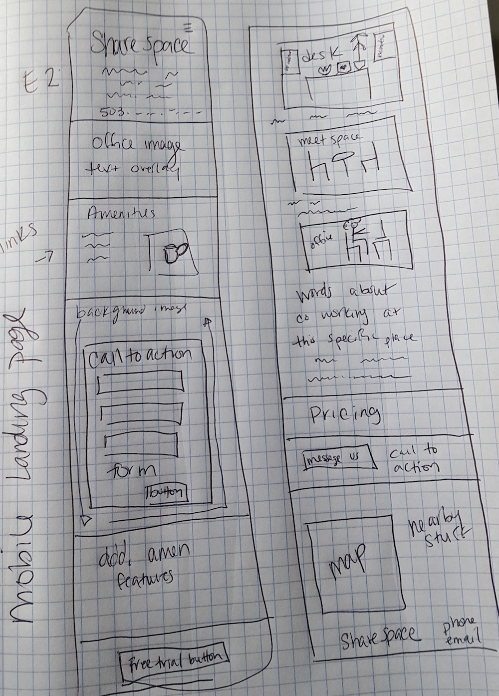

<!-- Twitter icon from https://github.com/carlsednaoui/gitsocial -->
[1.1]: http://i.imgur.com/tXSoThF.png (twitter icon with padding)
_Share-space_

#### _Epicodus Code Review_
_UI - Week 2 &amp; 3: Web Design Process - Freelance Co-working Contract_

#### **Dawn Mott** :sunrise_over_mountains: _June 1st, 2018_

## Description

_This app will showcase the features of a fictional shared workspace_

## Specs
Mobile Landing Page Sketch
  

Color palette
  

## Setup/Installation Requirements
_Please see info.md for client specs_

## Known Bugs

_There are many known :bug: at this time, this is a work in progress_

## Support and contact details

_If you'd like to chat, please contact_ @dawnrparty _on_ ![alt text][1.1]

## Technologies Used

_HTML, CSS, CSS Grid, Flex Box, JavaScript, Angular, and flattery_

### License

*This page is licensed under the MIT license*

&copy; 2018 **Dawn Mott** :sunrise_over_mountains:
