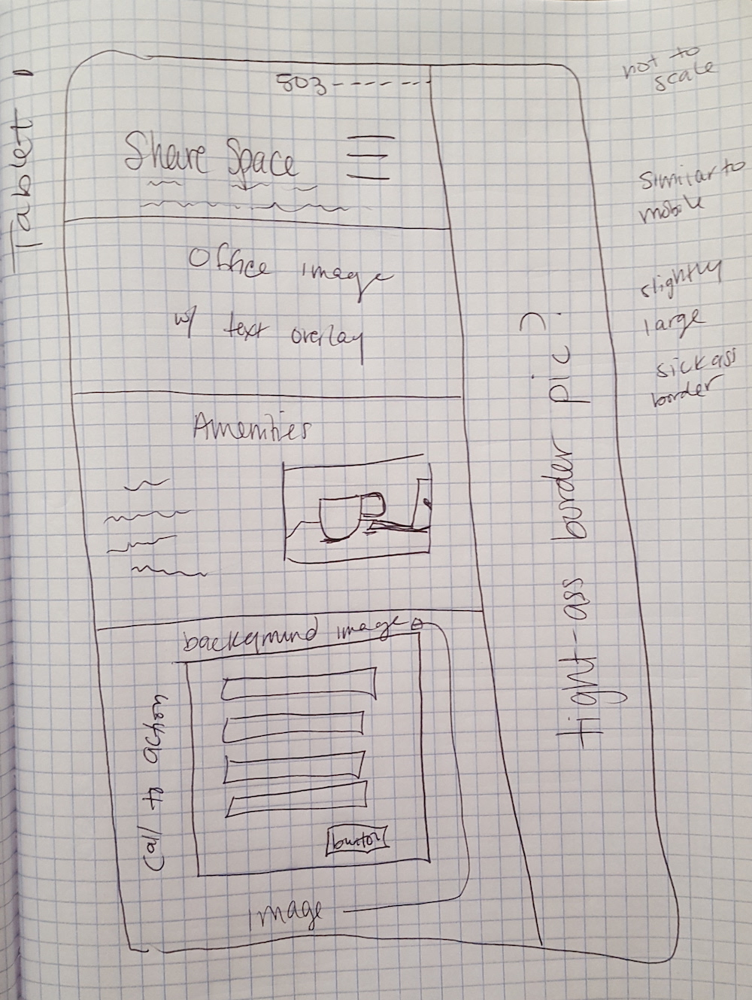

Research and brainstorm notes

Tablet Sketches
Tablet(medium) Landing Page Sketch and Sketch
    

    
    

Local Competition:

inspiration sites:
http://www.deskandmug.com/
http://www.pepcoworkingshop.com/
https://www.theperlene.com/
http://www.cleanslatepdx.com/

not in brand:
~~http://nxtindustries.com/~~
~~http://www.urbanofficeplace.com/~~
~~http://www.nedspace.com/~~
~~https://hatchthefuture.org/~~
~~https://collectiveagency.co/~~
~~https://colab.one/~~

Thoughts:
Main page
* Homepage to be branded
  * logo
  * catch phrase
  * colors
  

  * font/s
   

`<link href="https://fonts.googleapis.com/css?family=Cabin|Mr+De+Haviland" rel="stylesheet">`
`font-family: 'Mr De Haviland', cursive;
font-family: 'Cabin', sans-serif;`
* call to action at top/bottom
* office/space images
  * amenities near top
  * price on page, but not immediately
* map to location bottom

Pages:
  * Main
  * amenities
  * prices
  * about/history
